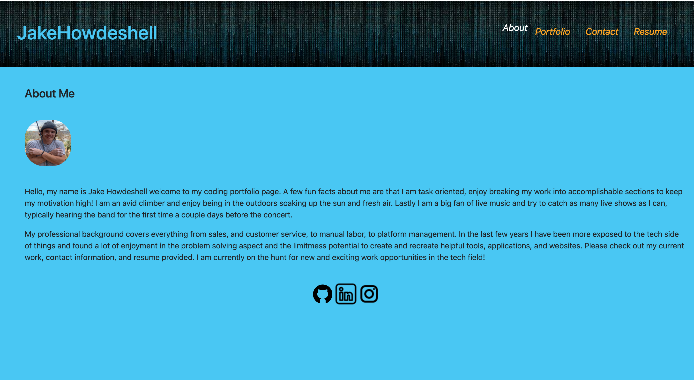

# React Portfolio

## Description

AS AN employer looking for candidates with experience building single-page applications
I WANT to view a potential employee's deployed React portfolio of work samples
SO THAT I can assess whether they're a good candidate for an open position

GIVEN a single-page application portfolio for a web developer
WHEN I load the portfolio
THEN I am presented with a page containing a header, a section for content, and a footer

WHEN I view the header
THEN I am presented with the developer's name and navigation with titles corresponding to different sections of the portfolio

WHEN I view the navigation titles
THEN I am presented with the titles About Me, Portfolio, Contact, and Resume, and the title corresponding to the current section is highlighted

WHEN I click on a navigation title
THEN I am presented with the corresponding section below the navigation without the page reloading and that title is highlighted

WHEN I load the portfolio the first time
THEN the About Me title and section are selected by default

WHEN I am presented with the About Me section
THEN I see a recent photo or avatar of the developer and a short bio about them

WHEN I am presented with the Portfolio section
THEN I see titled images of six of the developer’s applications with links to both the deployed applications and the corresponding GitHub repository

WHEN I am presented with the Contact section
THEN I see a contact form with fields for a name, an email address, and a message

WHEN I move my cursor out of one of the form fields without entering text
THEN I receive a notification that this field is required

WHEN I enter text into the email address field
THEN I receive a notification if I have entered an invalid email address

WHEN I am presented with the Resume section
THEN I see a link to a downloadable resume and a list of the developer’s proficiencies

WHEN I view the footer
THEN I am presented with text or icon links to the developer’s GitHub and LinkedIn profiles, and their profile on a third platform (Stack Overflow, Twitter) 

## Table of Contents

- [Installation](#installation)

- [Usage](#usage)

- [Questions](#questions)

## Installation

- Step 1: The user will need to have [Node.js](https://nodejs.org/en/download) installed on their PC or use the link provided to install it.

- Step 2: Before running the program the user will need to install the packages by typing 'npm install' into the terminal integrated to the location of the folder holding the program and then 'npm run start'.

- Step 3: The user will need to set up a [Netlify](https://app.netlify.com/) profile.

- Step 4: Netlify will need to be linked to your GitHub account. This can be accomplished before creating the app on the home page by clicking the link to Github button.

## Usage

Link to app: https://jakehowdeshell-portfolio.netlify.app/

This application was designed to display my portfolio, which includes an about me page that has a short discription of me, a porfolio page which shows some apps I have created with links to them, a contact page which allows the viewer to provide a message with a way to contact them, as well as a resume page which allows the user to download my resume. 

## Questions

Regarding any questions please check out my Github profile [JakeHowdeshell](https://github.com/JakeHowdeshell).

Or send me an [email](mailto:Jakehowdy@gmail.com).

